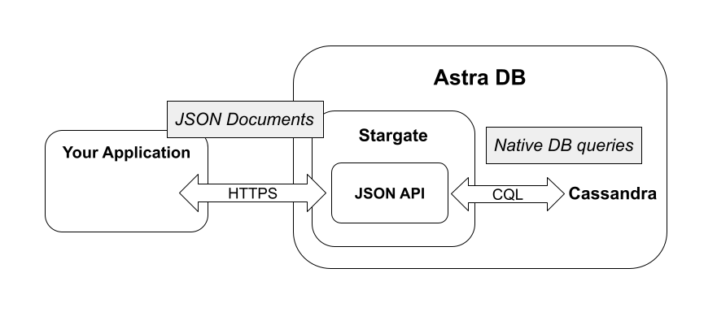
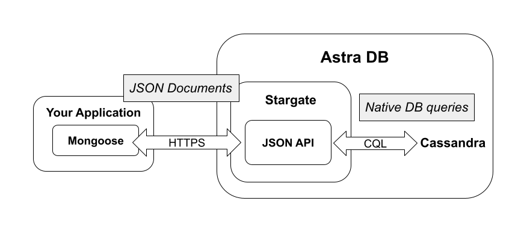
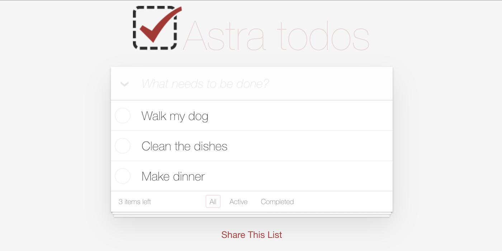

# Overview

Our **JSON API** is an HTTP API and part of the [Stargate](https://stargate.io) open source project. The idea is to provide an abstraction on top of Apache Cassandra™ to allow document-oriented data access patterns. Any application code that can call an HTTP end point can interact with our JSON API.



Our JSON API works best with the associated Mongoose for Astra client library. Now you can run your Mongoose applications on Astra with only a configuration change. Download Mongoose for Astra from [Github](https://github.com/stargate/stargate-mongoose).



What would you like to do first?

## 1 See a beginning example in a sandbox environment
**To Do List Application**
  
Here we provide a fullstack development example of a simple to do list, using Astra DB's sandbox environment as the storage backend (this means your data will not persist beyond this browser session).



## 2 See the JSON

```json
{
	"Astra todos": {
		"Tasks": "What needs to be done?",
		"priorities": [
			"Walk my dog",
			"Clean the dishes",
			"Make dinner"
		]
	}
}
```

## 3 See the source code

```bash
curl --request POST \
  --url https://$ASTRA_DB_ID-$ASTRA_DB_REGION.apps.astra.datastax.com/api/rest/v2/namespaces/$ASTRA_DB_KEYSPACE/collections/to_do \
  -H "X-Cassandra-Token: $ASTRA_DB_APPLICATION_TOKEN" \
  -H 'Content-Type: application/json' \
  -d '{
	"Astra todos": {
		"Tasks": "What needs to be done?",
		"priorities": [
			"Walk my dog",
			"Clean the dishes",
			"Make dinner"
		]
	}
}'
  ```

## 4 Quick Start

0. Log in to your Astra account
1. [Click here]to clone the collection into the sandbox environment; this will:
    * Create a namespace within the sandbox environment
    * Generate a token for this sandbox session
    * Create a Collection in that namespace and copy the above JSON as a Document into that Collection
2. Make changes or additions to your JSON:

```json
{
	"Astra todos": {
		"Tasks": "What needs to be done?",
		"priorities": [
			"Walk my dog",
			"Clean the dishes",
			"Make dinner"
		]
	}
}
```
3. Then [Click here] to run the update command
<details>
	<summary>Show command syntax</summary>
	let doc = await Sandbox.namespace.collection.document.findOneAndUpdate(filter, update, {new: true});
</details>

4. [Click here] to run the To Do application


### See an intermediate example in a sandbox environment

**Example goes here**


### See an advanced example in a sandbox environment

**Example goes here**

### No example necessary; let’s create a document collection

Something like [this page](https://github.com/DataStax-Examples/sample-app-template/blob/master/GETTING_STARTED.md#create-an-astra-db) should go here, but expressed only in JSON idioms, not Cassandra-isms.

### Learn more - Cassandra and JSON

[Learn more](link to public Github document goes here) about Cassandra’s NoSQL core expressed in a JSON idiom

### Learn more - Stargate and Mongoose

[Learn more](https://github.com/stargate/stargate-mongoose) about Stargate's variant of the Mongoose library for connecting to our JSON API
